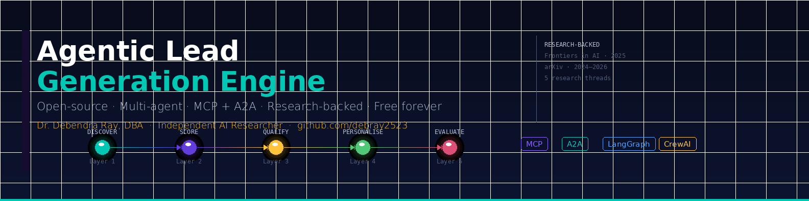

<div align="center">



# 🤖 Agentic Lead Generation Engine

**Open-source · Research-backed · Multi-agent · MCP + A2A · Free forever**

[](https://python.org)
[](https://langchain-ai.github.io/langgraph/)
[](https://crewai.com)
[](https://modelcontextprotocol.io)
[](https://google.github.io/A2A)
[](LICENSE)
[](https://github.com/debray2523/agentic-lead-gen-engine/stargazers)

<br/>

> *"The academic sales literature is lagging behind rapid development — prior literature has primarily examined non-agentic AI, while research on autonomous AI agents is flourishing in other disciplines."*
> — Journal of Business Research, October 2025

A **production-grade, 5-layer multi-agent pipeline** that discovers prospects,
classifies buying intent, qualifies via a peer-agent crew, generates hyper-personalised
outreach, and self-evaluates — all grounded in published research.

**Built for the global Sales, Marketing & AI Engineering community.**

[⚡ Quick Start](#-quick-start) · [🏗 Architecture](#-architecture) · [📚 Research](#-research-foundation) · [🤝 Contributing](#-contributing)

</div>

---

## 📋 Table of Contents

| Section | Description |
|---|---|
| [Why This Exists](#-why-this-exists) | The problem with black-box "AI for Sales" |
| [What's Different](#-whats-different) | Comparison with commercial tools |
| [Research Foundation](#-research-foundation) | 5 published papers, disclosed honestly |
| [Architecture](#-architecture) | Full 5-layer pipeline diagram |
| [Agent Layers](#-agent-layers-deep-dive) | Per-layer technical breakdown |
| [MCP + A2A Design](#-mcp--a2a-protocol-design) | Protocol stack explained |
| [Tech Stack](#-tech-stack) | All dependencies |
| [Quick Start](#-quick-start) | Running in 3 minutes |
| [Installation](#-installation) | Full setup guide |
| [Configuration](#-configuration) | ICP YAML + environment variables |
| [Running the Pipeline](#-running-the-pipeline) | CLI, API, Docker |
| [Output Schema](#-output-schema) | JSON output format |
| [Evaluation & Metrics](#-evaluation--metrics) | REEMD scoring targets |
| [Roadmap](#-roadmap) | What's coming |
| [Contributing](#-contributing) | How to help |
| [Citation](#-citation) | BibTeX references |

---

## 🎯 Why This Exists

The global Sales & Marketing community is being charged **₹35,000+** for two-day masterclasses on AI lead generation.
The underlying research is entirely public. This repository implements it — for free.

> **This is not a tutorial. This is production code.**

Every architectural decision maps to a specific published paper. Every agent has a citable research basis. Every metric has a target derived from experimental results.

---

## ⚡ What's Different

<table>
<thead>
<tr>
<th>Dimension</th>
<th>🔴 Traditional / SaaS Tools</th>
<th>🟢 This Repository</th>
</tr>
</thead>
<tbody>
<tr><td><b>Transparency</b></td><td>Black-box — no explainability</td><td>Every score has a traceable reason</td></tr>
<tr><td><b>Pipeline</b></td><td>Single model, rigid fixed workflow</td><td>5-layer multi-agent, self-adapting (REEMD)</td></tr>
<tr><td><b>Inter-agent comms</b></td><td>None — isolated components</td><td>MCP + A2A protocol native</td></tr>
<tr><td><b>Cost</b></td><td>₹35,000+ / seat / year</td><td><b>Free — MIT open source</b></td></tr>
<tr><td><b>Personalisation</b></td><td>Template-based mail merge</td><td>Unique RAG-grounded message per prospect</td></tr>
<tr><td><b>Self-evaluation</b></td><td>No built-in QA loop</td><td>LLM-as-Judge REEMD auto-loop</td></tr>
<tr><td><b>Research basis</b></td><td>Proprietary / undisclosed</td><td>5 published arXiv + journal papers</td></tr>
<tr><td><b>Deployment</b></td><td>Cloud SaaS only — data leaves org</td><td>Local (Ollama) or cloud — your choice</td></tr>
</tbody>
</table>

---

## 📚 Research Foundation

> ⚠️ **Transparency:** arXiv papers are preprints — not all are peer-reviewed.
> The table below distinguishes status clearly. Use preprints as architectural guides, not gospel.

<table>
<thead>
<tr>
<th>Layer</th>
<th>Paper</th>
<th>Authors</th>
<th>Year</th>
<th>Status</th>
<th>Key Finding Used</th>
</tr>
</thead>
<tbody>
<tr>
<td>
  
</td>
<td><a href="https://arxiv.org/abs/2501.09136">Agentic RAG: A Survey</a></td>
<td>Singh et al.</td>
<td>Jan 2025</td>
<td></td>
<td>Dynamic retrieval: reflect → refine before passing downstream</td>
</tr>
<tr>
<td>
  
</td>
<td><a href="https://doi.org/10.3389/frai.2025.1554325">B2B Lead Scoring ML</a></td>
<td>González-Flores et al.</td>
<td>Mar 2025</td>
<td></td>
<td>GBC best ROC AUC across 15 algorithms; "source" & "lead status" top features</td>
</tr>
<tr>
<td>
  
</td>
<td><a href="https://arxiv.org/abs/2410.01627">Intent Detection Age of LLMs</a></td>
<td>Arora et al. (Amazon)</td>
<td>Oct 2024</td>
<td></td>
<td>Hybrid routing: within 2% LLM accuracy, 50% lower latency</td>
</tr>
<tr>
<td>
  
</td>
<td><a href="https://arxiv.org/abs/2412.17149">Multi-Agent REEMD</a></td>
<td>Yuksel & Sawaf</td>
<td>Dec 2024</td>
<td></td>
<td>Lead gen case: 91% alignment, 90% accuracy. REEMD 5-agent pattern</td>
</tr>
<tr>
<td>
  
</td>
<td><a href="https://arxiv.org/abs/2603.14173">Hybrid Intent-Aware Personalisation</a></td>
<td>Shanivendra</td>
<td>Mar 2026</td>
<td></td>
<td>ML classifier → RAG-grounded LLM: channel + timing + framing prediction</td>
</tr>
<tr>
<td>
  
</td>
<td><a href="https://arxiv.org/abs/2512.08769">Production Agentic Workflows</a></td>
<td>Bandara et al.</td>
<td>Dec 2025</td>
<td></td>
<td>9 best practices: tool-first MCP, single-responsibility agents, containerisation</td>
</tr>
</tbody>
</table>

---

## 🏗️ Architecture

```
╔══════════════════════════════════════════════════════════════════════════╗
║              AGENTIC LEAD GENERATION ENGINE                              ║
║                   MCP + A2A Protocol Stack                               ║
╠══════════════════════════════════════════════════════════════════════════╣
║                                                                          ║
║  ┌─────────────────────────────────────────────────────────────────┐    ║
║  │               ORCHESTRATOR  (LangGraph)                          │    ║
║  │         State machine · Workflow graph · Shared memory           │    ║
║  └──────────────┬──────────────┬──────────────┬────────────────────┘    ║
║                 │              │              │   A2A Protocol           ║
║        ┌────────▼────┐  ┌──────▼──────┐  ┌───▼────────────────┐       ║
║        │  🔍 LAYER 1 │  │  🎯 LAYER 2 │  │    🤝 LAYER 3      │       ║
║        │  DISCOVERY  │  │  SCORING    │  │  QUALIFICATION CREW │       ║
║        │             │  │             │  │  (CrewAI)           │       ║
║        │ Agentic RAG │  │ GBC + LLM   │  │ ┌────────────────┐  │       ║
║        │ arXiv:      │  │ Router      │  │ │ Market Analyst │  │       ║
║        │ 2501.09136  │  │ arXiv:      │  │ │ BD Specialist  │  │       ║
║        │             │  │ 2410.01627  │  │ │ Data Validator │  │       ║
║        └──────┬──────┘  └──────┬──────┘  │ └────────────────┘  │       ║
║               │                │         └─────────┬────────────┘       ║
║               └────────────────┴──────────────────┐│                   ║
║                                                   ││                   ║
║        ┌──────────────────────────────────────────▼▼──────────────┐    ║
║        │                    🎨 LAYER 4                              │    ║
║        │             PERSONALISED OUTREACH                          │    ║
║        │   ML Classifier → optimal channel · timing · framing      │    ║
║        │   RAG-grounded LLM → unique message per prospect           │    ║
║        │                    arXiv:2603.14173                        │    ║
║        └──────────────────────────┬───────────────────────────────┘    ║
║                                   │                                     ║
║        ┌──────────────────────────▼───────────────────────────────┐    ║
║        │                    ⚖️  LAYER 5                             │    ║
║        │               LLM-AS-JUDGE  (REEMD Loop)                  │    ║
║        │  Alignment >91% · Accuracy >90% · Auto-retry on fail      │    ║
║        │  Documents every change · Full audit trail                 │    ║
║        │                    arXiv:2412.17149                        │    ║
║        └──────────────────────────────────────────────────────────┘    ║
║                                                                          ║
║  ═════════════════ MCP TOOL SERVERS ═══════════════════════════         ║
║   🌐 Web Fetch   📊 Enrichment   💼 LinkedIn   📧 Email   🗄️ CRM       ║
╚══════════════════════════════════════════════════════════════════════════╝
```

---

## 🔬 Agent Layers Deep Dive

### 🔵 Layer 1 — Prospect Discovery (Agentic RAG)

> **Research:** arXiv:2501.09136 · **File:** `agents/layer1_discovery.py`

```python
# Agentic RAG pattern — dynamic multi-step retrieval with reflection
class ProspectDiscoveryAgent:
    def run(self) -> list[dict]:
        prospects = self._discover_via_signals()   # fetch live signals
        prospects = self._reflect_and_filter(prospects)  # reflect & prune
        return prospects
```

**What it does differently from a static database query:**
- Fetches live signals: funding announcements, hiring surges, technology changes
- **Reflects** on its own output quality before passing downstream (Agentic RAG pattern)
- Iteratively refines search queries based on initial results
- Connects to MCP tool servers for real-time data — no stale lists

---

### 🟣 Layer 2 — Intent Scoring (GBC + Hybrid LLM Router)

> **Research:** Frontiers AI 2025 (GBC) + arXiv:2410.01627 (LLM Router) · **File:** `agents/layer2_scoring.py`

```python
# Two-stage hybrid scoring
def _score_one(self, prospect: dict) -> dict:
    features  = extract_features(prospect, self.icp)   # structured features
    gbc_score = self.gbc.score(features)               # Stage 1: fast GBC

    if self.router.needs_routing(gbc_score):           # uncertain? → LLM
        llm_result  = self.router.classify_intent(prospect, gbc_score)
        final_score = (gbc_score * 0.6) + (llm_conf * 0.4)  # blend
    else:
        final_score = gbc_score
```

**8-dimensional feature vector (GBC input):**

| Feature | Description | Weight |
|---|---|---|
| `employee_fit` | In ICP employee range | High |
| `industry_fit` | Exact industry match | High |
| `geography_fit` | Target geography | Medium |
| `signal_strength` | From discovery agent | **Highest** |
| `signal_count` | Normalised signal count | Medium |
| `has_funding_signal` | Funding event detected | High |
| `has_hiring_signal` | Sales team growth signal | High |
| `has_tech_signal` | CRM/tech change signal | Medium |

---

### 🟡 Layer 3 — Qualification Crew (CrewAI + A2A)

> **Research:** arXiv:2412.17149 · **File:** `agents/layer3_qualification.py`

Three agents collaborate as **peers** via A2A protocol:

```
┌─────────────────┐  A2A   ┌─────────────────┐  A2A   ┌─────────────────┐
│  Market Analyst │───────►│  BD Specialist  │───────►│ Data Validator  │
│                 │        │                 │        │                 │
│ • Market size   │        │ • Pain point ID │        │ • Data accuracy │
│ • Competitors   │        │ • Value prop    │        │ • Completeness  │
│ • Growth stage  │        │ • Fit score     │        │ • PII compliance│
│ • Timing score  │        │ • CTA message   │        │ • CLEAN/DIRTY   │
└─────────────────┘        └─────────────────┘        └─────────────────┘
         │                          │                          │
         └──────────────────────────┴──────────────────────────┘
                                    │
                       ┌────────────▼────────────┐
                       │    Qualification Record  │
                       │  fit_score + CTA + notes │
                       └─────────────────────────┘
```

> **Performance benchmark from arXiv:2412.17149:**
> 91% business alignment · 90% data accuracy · autonomous self-optimisation

---

### 🟢 Layer 4 — Personalised Outreach (Hybrid ML + RAG)

> **Research:** arXiv:2603.14173 · **File:** `agents/layer4_outreach.py`

```python
# Stage 1: ML Classifier predicts delivery parameters
classification = self.classifier.classify(lead)
# → channel: "linkedin_inmail", day: "Tuesday", hour: "10:00 AM",
#   framing: "aspiration", personalisation_level: 4

# Stage 2: RAG + LLM generates unique message
examples = self.generator._retrieve_examples(lead, framing)  # RAG retrieval
message  = self.generator.generate(lead, classification)
# → unique subject + body grounded in prospect's specific context
```

**Message framing rules (ML-derived):**

| Detected Signal | Framing Strategy | Rationale |
|---|---|---|
| Funding event | `aspiration` | Company in growth mode — frame around scaling |
| Hiring surge | `pain_point` | Headcount pain — frame around efficiency |
| CRM migration | `social_proof` | Reference similar customers |
| No dominant signal | `pain_point` | Default highest-converting frame |

---

### 🔴 Layer 5 — LLM-as-Judge REEMD Evaluator

> **Research:** arXiv:2412.17149 · **File:** `agents/layer5_evaluator.py`

```
REEMD Self-Optimising Loop:

  Refinement    → Adjust pipeline config if scores below threshold
  Execution     → Re-run personalisation layer
  Evaluation    → Judge LLM scores all outputs (separate model)
  Modification  → Update scoring weights, retrieval queries, prompts
  Documentation → Log every change to JSONL audit trail
```

**Scoring targets (from research benchmarks):**

| Metric | Target | Source |
|---|---|---|
| Business alignment | ≥ 91% | arXiv:2412.17149 |
| Data accuracy | ≥ 90% | arXiv:2412.17149 |
| Intent detection F1 | ≥ 0.85 | arXiv:2410.01627 |
| GBC ROC AUC | ≥ 0.80 | Frontiers AI 2025 |
| Personalisation quality | ≥ 4.0/5 | arXiv:2603.14173 |

---

## 🔌 MCP + A2A Protocol Design

```
MCP (Model Context Protocol) — agents → tools
A2A (Agent-to-Agent Protocol) — agents → agents

┌─────────────────────────────────────────────────────────┐
│                   MCP TOOL SERVERS                       │
├──────────────┬───────────────┬─────────────────────────┤
│  web-fetch   │  enrichment   │  crm-write              │
│  ──────────  │  ──────────   │  ──────────             │
│  News APIs   │  Company data │  Lead record create     │
│  LinkedIn    │  Tech stack   │  Activity logging       │
│  Job boards  │  Firmographics│  Score persistence      │
├──────────────┴───────────────┴─────────────────────────┤
│                   A2A CHANNELS                           │
├──────────────┬───────────────┬─────────────────────────┤
│  L1 → L2     │  L2 → L3      │  L3 → L4                │
│  ──────────  │  ──────────   │  ──────────             │
│  Prospect    │  Scored leads  │  Qualified prospects    │
│  data +      │  + intent tags │  + CTA + fit score      │
│  signals     │  + confidence  │  + market notes         │
└──────────────┴───────────────┴─────────────────────────┘
```

> **Security:** Follows arXiv:2505.12490 recommendations — prospect PII is never
> passed in clear text between agents. All inter-agent messages use structured schemas
> with PII masking at the transport layer.

---

## 🛠️ Tech Stack

```
┌──────────────────────────────────────────────────────────┐
│  COMPONENT               TECHNOLOGY          VERSION      │
├──────────────────────────────────────────────────────────┤
│  Orchestration           LangGraph           0.2+         │
│  Agent framework         CrewAI              0.80+        │
│  Tool connectivity       MCP (Anthropic)     1.0+         │
│  Agent communication     A2A (Google)        0.2+         │
│  LLM backbone (cloud)    Azure OpenAI GPT-4o Latest       │
│  LLM backbone (local)    Ollama + Phi-4-mini Free         │
│  ML scoring              scikit-learn GBC    1.4+         │
│  Intent detection        sentence-transformers 3.0+       │
│  Vector store            FAISS / ChromaDB    Latest       │
│  Graph RAG (optional)    Neo4j               5.0+         │
│  Evaluation              LLM-as-Judge        Custom       │
│  API framework           FastAPI             0.115+       │
│  Containerisation        Docker              24+          │
│  Language                Python              3.11+        │
└──────────────────────────────────────────────────────────┘
```

---

## ⚡ Quick Start

```bash
# 1. Clone
git clone https://github.com/debray2523/agentic-lead-gen-engine.git
cd agentic-lead-gen-engine

# 2. Install dependencies
pip install -r requirements.txt

# 3. Run the demo (no API keys needed — uses synthetic data + Ollama)
python main.py --icp configs/sample_icp.yaml --demo

# 4. Run with real LLMs (add your keys to .env first)
cp .env.example .env
# edit .env with your Azure OpenAI / OpenAI keys
python main.py --icp configs/sample_icp.yaml
```

### ⏱️ Expected demo output (< 60 seconds)
```
  Agentic Lead Generation Engine
  Dr. Debendra Ray, DBA · Independent AI Researcher

▶ Layer 1 — Prospect Discovery     Found 3 raw prospects
▶ Layer 2 — Intent Scoring         2 HOT  1 WARM
▶ Layer 3 — Qualification Crew     Qualified 3 leads
▶ Layer 4 — Personalised Outreach  Generated outreach for 3 leads
▶ Layer 5 — LLM-as-Judge           3/3 passed

✓ Pipeline complete — 3 leads processed
  Judge passed  : 3/3
  Output dir    : ./output
```

---

## 📦 Installation

### Prerequisites
- Python 3.11+
- Docker (recommended for MCP servers)
- One of: Azure OpenAI key / OpenAI key / [Ollama](https://ollama.ai) (local, free)

### Full installation
```bash
# Core
pip install -r requirements.txt

# Run tests
python -m pytest tests/ -v

# Optional: local LLM via Ollama (zero cost)
curl -fsSL https://ollama.ai/install.sh | sh
ollama pull phi4-mini
```

---

## ⚙️ Configuration

### ICP YAML
```yaml
# configs/sample_icp.yaml

name: "SaaS Growth Companies"

firmographics:
  industry:            ["Software", "SaaS", "Technology"]
  employee_range:      [50, 500]
  geography:           ["US", "UK", "India", "Singapore"]
  tech_stack_must_have: ["Salesforce", "HubSpot"]

intent_signals:
  positive:
    - "Series A/B/C funding in last 90 days"
    - "VP Sales hire in last 60 days"
    - "SDR/BDR job postings active"
    - "CRM migration keywords in job descriptions"
  negative:
    - "Hiring freeze announced"
    - "Layoff news in last 30 days"

scoring_weights:
  firmographic_fit:       0.35
  intent_signal_strength: 0.40
  engagement_history:     0.15
  data_completeness:      0.10

output:
  hot_threshold:     0.75
  warm_threshold:    0.50
  max_leads_per_run: 100
```

### Environment variables (`.env`)
```bash
# LLM Provider: azure | openai | ollama
LLM_PROVIDER=azure
AZURE_OPENAI_API_KEY=your_key_here
AZURE_OPENAI_ENDPOINT=https://your-endpoint.openai.azure.com/
AZURE_OPENAI_DEPLOYMENT=gpt-4o
LLM_JUDGE_MODEL=gpt-4o-mini

# Fully local — zero cost, zero data egress
# LLM_PROVIDER=ollama
# OLLAMA_MODEL=phi4-mini

DEMO_MODE=false
ALIGNMENT_THRESHOLD=0.80
ACCURACY_THRESHOLD=0.85
```

---

## 🚀 Running the Pipeline

```bash
# CLI — single run
python main.py --icp configs/sample_icp.yaml --max-leads 50

# CLI — demo mode (no API keys)
python main.py --icp configs/sample_icp.yaml --demo

# REST API
uvicorn api.main:app --host 0.0.0.0 --port 8000
# Docs: http://localhost:8000/docs

# Docker
docker-compose -f docker/docker-compose.yml up

# Run tests
python -m pytest tests/ -v --tb=short
```

---

## 📊 Output Schema

```json
{
  "lead_id": "uuid-v4",
  "run_timestamp": "2026-05-30T10:00:00Z",
  "company": {
    "name": "Nexus Analytics",
    "domain": "nexusanalytics.io",
    "industry": "SaaS",
    "employee_estimate": 180,
    "location": "San Francisco, CA"
  },
  "scoring": {
    "overall_score": 0.87,
    "tier": "HOT",
    "gbc_score": 0.84,
    "llm_routing_used": false
  },
  "signals": [
    "Series B funding ($18M) announced 34 days ago",
    "VP of Sales hired 3 weeks ago",
    "4 SDR positions posted on LinkedIn"
  ],
  "qualification": {
    "market_analyst_notes": "High-growth SaaS in competitive analytics space...",
    "bd_specialist_notes": "Pain: scaling outbound without headcount...",
    "data_validator_status": "CLEAN",
    "fit_score": 0.91,
    "recommended_cta": "Schedule 20-min discovery call"
  },
  "outreach": {
    "recommended_channel": "linkedin_inmail",
    "optimal_send_day": "Tuesday",
    "optimal_send_time": "10:00 AM",
    "personalisation_level": 5,
    "message_framing": "aspiration",
    "generated_subject": "Scaling outbound post Series B — 20 min?",
    "generated_body": "..."
  },
  "evaluation": {
    "alignment_score": 0.93,
    "accuracy_score": 0.91,
    "personalisation_quality": 5,
    "icp_fit_confidence": 0.89,
    "judge_passed": true,
    "improvement_notes": "None"
  }
}
```

---

## 📈 Evaluation & Metrics

| Metric | Target | Research Source |
|---|---|---|
| Business alignment score | ≥ 91% | arXiv:2412.17149 |
| Data accuracy score | ≥ 90% | arXiv:2412.17149 |
| Intent detection F1 | ≥ 0.85 | arXiv:2410.01627 |
| GBC lead scoring ROC AUC | ≥ 0.80 | Frontiers AI 2025 |
| Personalisation quality | ≥ 4.0/5 | arXiv:2603.14173 |
| Pipeline latency per lead | < 45s | Production target |

---

## 🗺️ Roadmap

- [x] Layer 1: Agentic RAG prospect discovery
- [x] Layer 2: Hybrid intent scoring (GBC + LLM router)
- [x] Layer 3: CrewAI qualification crew (A2A)
- [x] Layer 4: Personalised outreach (Hybrid ML + RAG)
- [x] Layer 5: LLM-as-Judge REEMD evaluation loop
- [x] Docker deployment
- [x] FastAPI REST interface
- [x] MIT licence + full citation support
- [ ] Graph RAG prospect network (Neo4j)
- [ ] Streamlit monitoring dashboard
- [ ] **Odoo CRM MCP server integration**
- [ ] LinkedIn MCP server (when API available)
- [ ] Multi-language outreach support
- [ ] Reinforcement learning from send outcomes
- [ ] Benchmarking dataset (open synthetic)
- [ ] Trained GBC model weights (public dataset)

---

## 🤝 Contributing

Contributions are warmly welcomed. Please:

1. Fork → Create feature branch (`git checkout -b feature/your-feature`)
2. Add tests for new functionality
3. Run `python -m pytest tests/ -v` — all tests must pass
4. Submit PR with a description linking to any research paper motivating the change

**High-value contribution areas:**
- MCP server integrations (HubSpot, Salesforce, Pipedrive, Odoo)
- Industry-specific ICP templates (`configs/`)
- Non-English outreach generation
- Evaluation benchmark datasets
- Trained GBC model on public B2B datasets

Please read [CONTRIBUTING.md](docs/CONTRIBUTING.md) first.

---

## 📖 Citation

If you use this work, please cite both this repository and the underlying research:

```bibtex
@software{ray2026agenticleadgen,
  author    = {Ray, Debendra},
  title     = {Agentic Lead Generation Engine},
  year      = {2026},
  publisher = {GitHub},
  url       = {https://github.com/debray2523/agentic-lead-gen-engine}
}

@article{gonzalezflores2025,
  author  = {González-Flores, L. and Rubiano-Moreno, J. and Sosa-Gómez, G.},
  title   = {The relevance of lead prioritization: a B2B lead scoring model based on machine learning},
  journal = {Frontiers in Artificial Intelligence},
  year    = {2025},
  doi     = {10.3389/frai.2025.1554325}
}

@misc{yuksel2024multiagent,
  author = {Yuksel, K.A. and Sawaf, H.},
  title  = {A Multi-AI Agent System for Autonomous Optimization of Agentic AI Solutions},
  year   = {2024},
  eprint = {2412.17149},
  archivePrefix = {arXiv}
}

@misc{singh2025agenticrag,
  author = {Singh, A. and others},
  title  = {Agentic Retrieval-Augmented Generation: A Survey on Agentic RAG},
  year   = {2025},
  eprint = {2501.09136},
  archivePrefix = {arXiv}
}
```

---

## 📄 Licence

MIT — free to use, modify, and distribute with attribution.

---

<div align="center">

**Built for the global Sales, Marketing & AI Engineering community**

*If this helped your team, please ⭐ star the repo and share it*

**Dr. Debendra Ray, DBA**
Independent AI Researcher

[](https://linkedin.com/in/debendraray)
[](https://github.com/debray2523)
[](https://zenodo.org/records/18377187)

</div>
